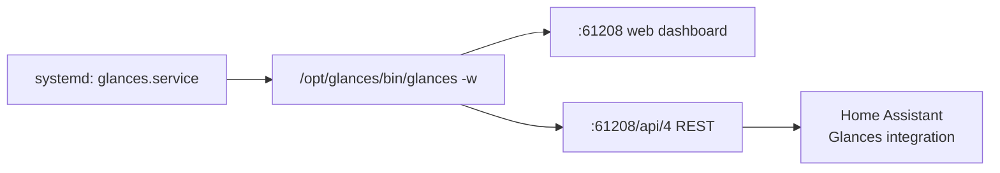

# Glances System Monitoring Setup (this Pi)

This documents exactly how Glances runs on this Pi as a always-on web/REST
service, so it can be rebuilt from scratch if the SD card / OS is ever
reflashed.

This is **independent of the `espresense-pi` project** — it's general OS
configuration, not part of that repo.

## What it provides

Glances runs in **web server mode** (`glances -w`). That single mode serves
two things on port `61208`:

| URL | Purpose |
| --- | --- |
| `http://rpi-4.local:61208/` | Browser dashboard (CPU, RAM, disk, network, temps, processes) |
| `http://rpi-4.local:61208/api/4/...` | REST API — this is what the Home Assistant **Glances integration** polls |

Current state on this Pi:

- Glances **4.5.6**, API version **4**, PsUtil **7.2.2**
- Installed in a dedicated venv at `/opt/glances` (Python 3.13.5)
- Runs as a systemd service, enabled at boot
- Listens on `0.0.0.0:61208` (all interfaces, no authentication)
- Glances log file: `~/.local/share/glances/glances.log`



## Why a venv instead of `apt install glances`

The Raspberry Pi OS package is usually several major versions behind, and
recent Debian releases mark the system Python as
[externally managed](https://peps.python.org/pep-0668/), so `pip install`
into it is blocked. A venv under `/opt` sidesteps both problems and keeps
Glances upgradable independently of the OS.

## 1. Create the venv and install Glances

```bash
sudo apt update
sudo apt install -y python3-venv python3-pip

sudo python3 -m venv /opt/glances
sudo /opt/glances/bin/pip install --upgrade pip
sudo /opt/glances/bin/pip install 'glances[web]'
```

The `[web]` extra is what pulls in the web/REST server dependencies
(`fastapi`, `uvicorn`, `jinja2`). Without it, `glances -w` fails at startup.

Verify:

```bash
/opt/glances/bin/glances -V
```

## 2. Install the systemd unit

File: `/etc/systemd/system/glances.service`

```ini
[Unit]
Description=Glances system monitoring
After=network-online.target
Wants=network-online.target

[Service]
Type=simple
ExecStart=/opt/glances/bin/glances -w
Restart=on-failure
RestartSec=5

[Install]
WantedBy=multi-user.target
```

To recreate:

```bash
sudo tee /etc/systemd/system/glances.service >/dev/null <<'EOF'
[Unit]
Description=Glances system monitoring
After=network-online.target
Wants=network-online.target

[Service]
Type=simple
ExecStart=/opt/glances/bin/glances -w
Restart=on-failure
RestartSec=5

[Install]
WantedBy=multi-user.target
EOF

sudo systemctl daemon-reload
sudo systemctl enable --now glances
```

## 3. Verify

```bash
systemctl status glances
curl -s http://127.0.0.1:61208/api/4/uptime
```

The API call should return something like `"2:11:13"`. If you get a
connection refused, the service didn't bind — check
`journalctl -u glances -n 50`.

## 4. Connect Home Assistant

In Home Assistant: **Settings → Devices & Services → Add Integration →
Glances**, then:

| Field | Value |
| --- | --- |
| Host | `192.168.178.20` (or `rpi-4.local`) |
| Port | `61208` |
| Version | `4` |
| Username / Password | leave empty |
| SSL | off |

This creates sensors for CPU load, memory use, disk usage, and CPU
temperature for this Pi.

## Security note

Glances is bound to `0.0.0.0` with **no authentication**, so anyone on the
LAN can read this Pi's process list and system stats. That's acceptable on a
trusted home network, but do **not** port-forward `61208` to the internet.

To lock it down, either bind it to the LAN interface only, or enable the
built-in basic auth:

```bash
# Option A: password-protect the web/REST server
ExecStart=/opt/glances/bin/glances -w --password

# Option B: only listen on a specific address
ExecStart=/opt/glances/bin/glances -w -B 192.168.178.20
```

Edit `/etc/systemd/system/glances.service`, then
`sudo systemctl daemon-reload && sudo systemctl restart glances`.
If you enable auth, update the Home Assistant integration's credentials to
match.

## Maintenance

```bash
# Follow logs
sudo journalctl -u glances -f

# Upgrade Glances in place
sudo /opt/glances/bin/pip install --upgrade 'glances[web]'
sudo systemctl restart glances

# Remove completely
sudo systemctl disable --now glances
sudo rm /etc/systemd/system/glances.service
sudo systemctl daemon-reload
sudo rm -rf /opt/glances
```

## Troubleshooting

| Symptom | Cause / fix |
| --- | --- |
| `glances -w` exits immediately | Web extras missing — reinstall with `'glances[web]'` |
| HA integration says "cannot connect" | Wrong API version; this install is API **4**, not 3 |
| Port 61208 not listening | Check `journalctl -u glances -n 50`; another process may hold the port |
| Stats missing after OS upgrade | `psutil` compiled against an old Python — recreate the venv |
